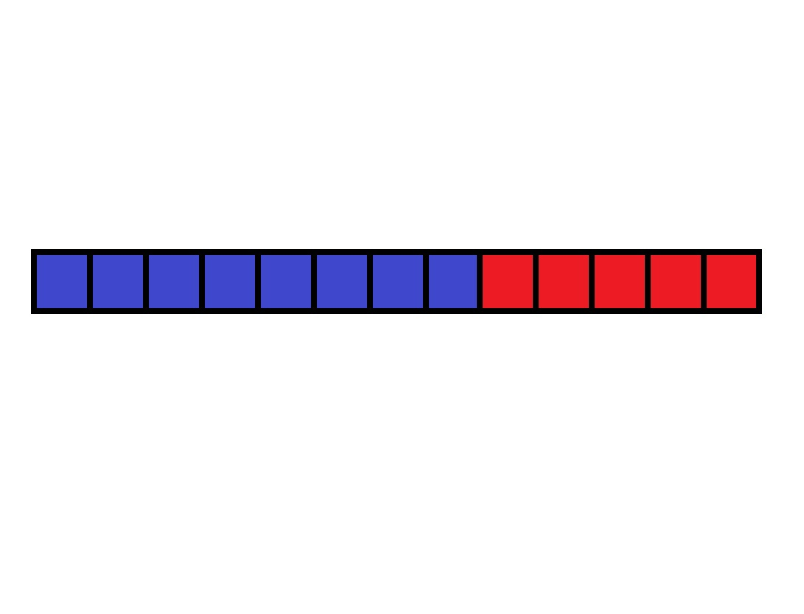
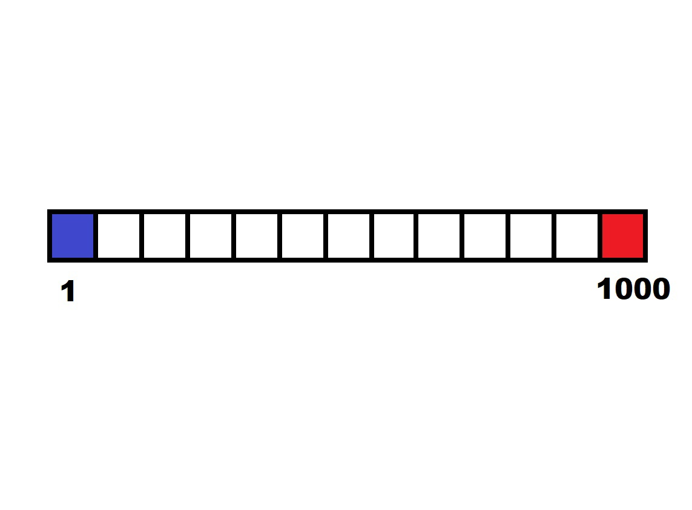
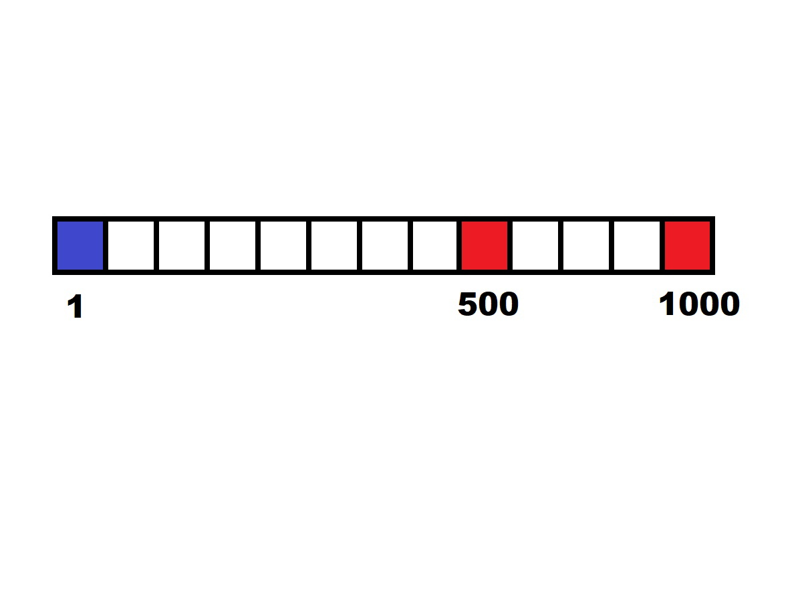
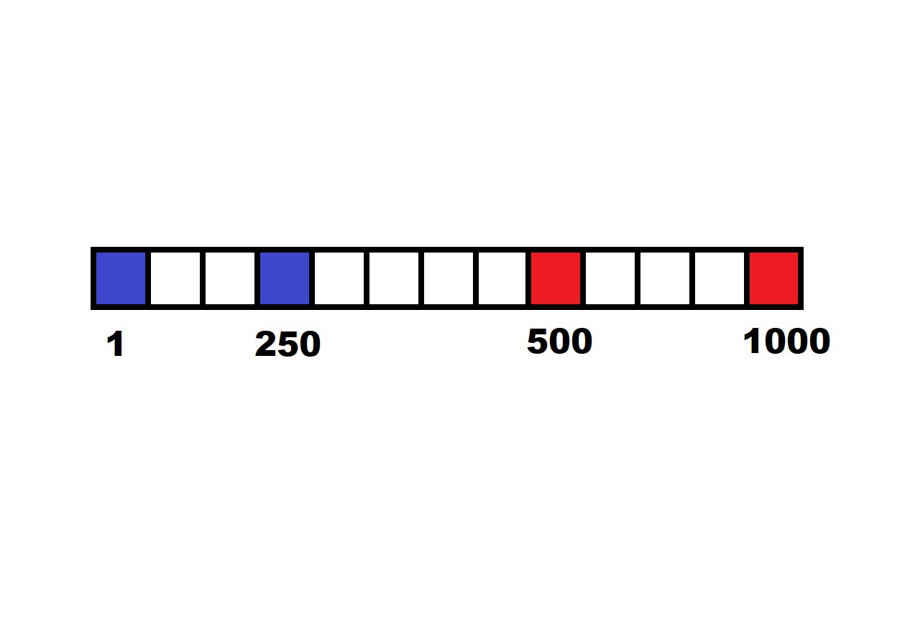
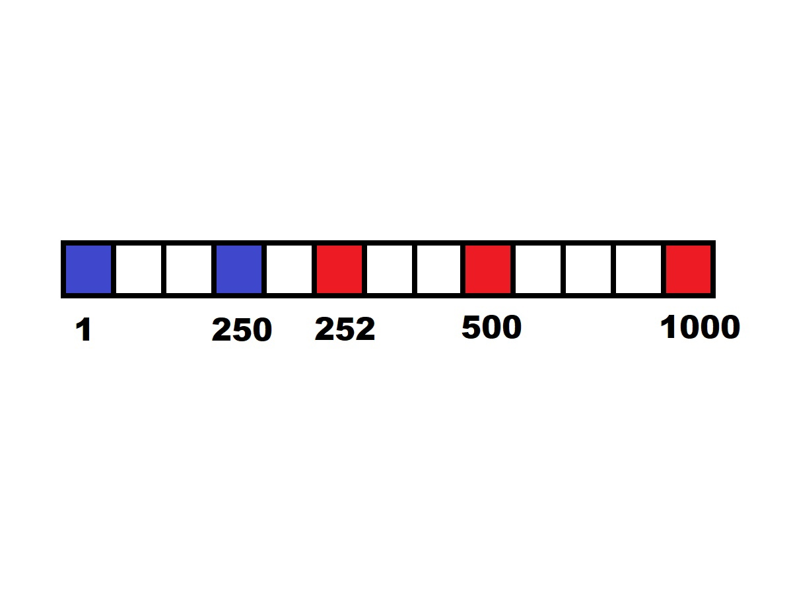
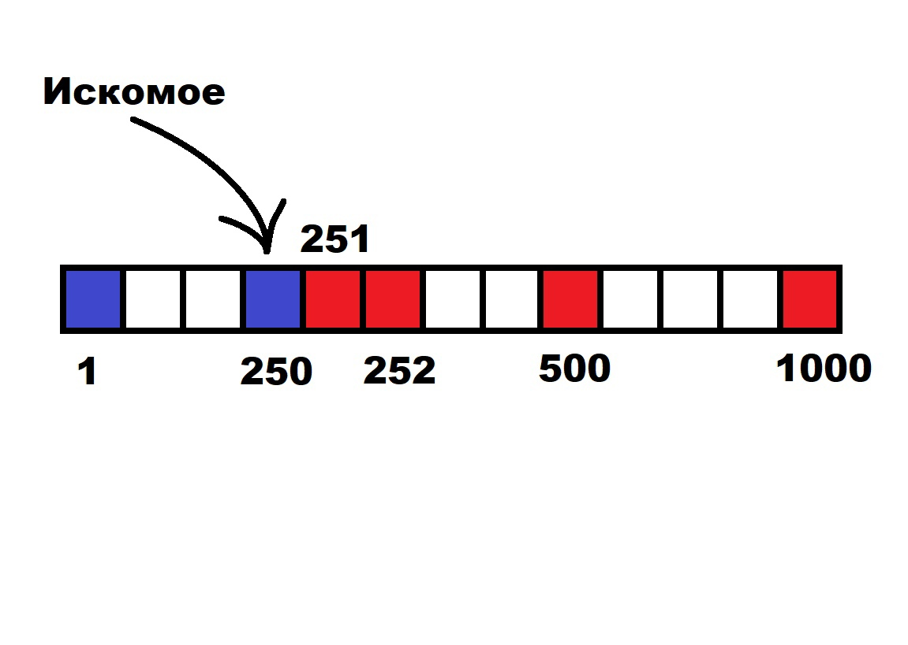

# Бинарный поиск

## Содержание

[**Мотивация**](#мотивация)

[**Концепция**](#концепция)

[**Асимптотика**](#асимптотика)

[**Применение**](#применение-в-реальных-задачах)

[**Резюме**](#резюме)

[**Пример**](#пример)

[**Реализация**](#реализация)

[**Бинарный поиск в массиве**](#бинарный-поиск-в-массиве)

[**Тонкости**](#тонкости)

[**Двоичные подъёмы**](#двоичные-подъёмы)

[**Доп. задача**](#задача-про-обезьяну-и-телефон)

## Мотивация

Для понимания того, какую задачу решает бинарный поиск, приведём какой-нибудь стандартный пример.  
Представим, что ваш друг загадал число и чем быстрее вы его отгадаете, тем больше мармеладок получите. Вы можете спрашивать - "Это число N?". Друг может отвечать:
> 1) Ваше число, больше чем его
> 2) Ваше число меньше или равно, чем его 

- Какова ваша первая стратегия? *Подразумевается спрашивать подряд.*

- Можете ли как-то тривиально улучшить? *Подразумевается спрашивать с небольшим интервлом. Например чётные числа.*

- Можете ли как-то улучшить вашу стратегию, если число гаранитированно меньше `N`? *Подразумевается, например, спрашивать с интервалом `sqrt(N)` и затем ещё `sqrt(N)` вопросов*

- Ответьте, сколько вопросов вы зададите другу в вашей лучшей стратегии, если он загадал числа `100`, `1000`, `100000`?

Бинпоиск позволяет решать эту задачу за `7`, `10` и `17` вопросов соотв.

Или, что более математично, за `O(log(n))`.

## Концепция

Как мы будем достигать таких результатов? Есть ли наилучшее решение по количеству вопросов? Ответы на эти вопросы даёт бинарный поиск.

Как и в любой задаче начнём первичный анализ: рассмотрим, какие ответы наш собеседник будет давать на любой наш вопрос. Для простоты - красный цвет, значит наше число больше. Синий цвет значит, что наше число меньше или равно.

<center></center>

- Объяснение картинки: то есть до какого-то момента друг будет говорить(имея ввиду если бы мы ему задали все эти вопросы, то вот что бы он нам ответил):  
> `1 <= N`  
> `2 <= N`  
> ...  
> `N <= N`  
- А затем начнёт говорить:
> `N+1 > N`  
> ...  
> `1000 > N`  

- Какое число на этой картинке загадал наш друг(имея ввиду визуально укажите клеточку)?

Как мы видим, в какой-то момент наступает перелом, и наш собеседник начинает отвечать по-другому. На самом деле, нам важен именно этот переломный момент, вернее самое правое число в синей области.

От этой картинки мы будем отталкиваться и в этой, и во всех остальных задачах на бинпоиск, так что её стоит запомнить.

- Теперь поймём как мы будем искать этот перелом:
Сперва найдём от чего оттолкнуться - загаданное число точно больше или равно `1` и точно меньше `1000` (Допустим вы с другом договорились не загадывать такие большие числа. Это как бы "условия игры" или "условия задачи"). Поставим эти границе на картинке: `1` - синий цвет, `1000` - красный цвет.

Когда мы начинаем наш бинпоиск - мы видим такую картинку, и только знаем, что по идее она выглядит заполненной(как выше):

<center></center>

Первый шаг - узнаем какого цвета `500`.  
Спрашиваем: Это `500`?  
Получаем ответ: Ваше число - больше, чем загаданное.  

Отлично - мы теперь знаем, что число `500` тоже красное! Значит перелом происходит где-то между `1` и `500`. Продолжим искать ровно там.  
Заметьте - одним вопросом мы отсекли целых `500` неправильных чисел, т.е. чисел, где искать перелом не получится.

<center></center>

Второй шаг - мы опять спрашиваем про середину нашего отрезка.  
Спрашиваем: Это `250`?  
Получаем ответ: Ваше число - меньше либо равно, чем загаданное.  
А значит число `250` - синее.  

<center></center>

Я очень надеюсь вы уловили суть того, что будет происходить далее. Мы постепенно будем сужать наш рассматриваемый отрезок, притом уменьшая его в два раза каждый ход. Для полного понимания - покажем, как всё произойдёт в конце. Представим, что собеседник загадал число `250`.

Тогда все дальнейшие ответы будут "Ваше число больше загаданного". И картинка перед итоговым шагом будет такая:

<center></center>

Осталось понять - какого цвета `251`.
Задаём последний вопрос - это `251`?  
Ответ - ваше число больше, чем загаданное.  
Мы окончательно понимаем, что `250` - это крайнее синее число, т.е. искомое. Картинка становится такой:

<center></center>

Мы молодцы, нашли что хотели.

## Асимптотика

Как вы могли заметить, количество заданных вопросов - двоичный логарифм от изначальных ограничений. Т.е. если изначально отрезок длины `1e9`, то вопросов будет задано около `30`.

Более того - это наименьшее число вопрсов, которое можно задать. Почему?  
Небольшое доказательство:  
Пусть мы задали `k` вопросов. Тогда возможных комбинаций ответов мы можем получить `2^k`. Это значит, что `2^k >= n`, по принципу Дирихле (чтобы каждому числу досталось хотя бы по одной комбинации ответов). А значит `k >= log(n)`, что и доказывает оптимальность нашего решения.

## Применение в реальных задачах

В настоящих задачах есть только входные данные, вы и программа. Так что вам по входным данным придётся понимать какого цвета то или иное число. Вы должны сами создавать функцию собеседника, которая будет отвечать - какого цвета то или иное число.

Например, прошлая задача была бы такой - вам дано число `N = 250`.
Функция:

```c++
int N = 250;
check(int myNumber) {
    if (myNumber > N) {
        return true; // КРАСНЫЙ
    } else {
        return false; // СИНИЙ
    }
}
```

- Замечание: содержательная часть задачи на бинпоиск - понять что это бинпоиск и написать функцию `check`. Остальной алгоритм не меняется из раза в раз - спрашиваем середину и уменьшаем отрезок пополам. 

## Резюме

Таким образом, на практике - основные этапы решения задачи на бинпоиск:
1) Понять, что применима красно-синяя картинка и какое число будем "угадывать"
> Т.е. наша цель сформулировать контрольный вопрос и увидеть, что сначала на него ответ будет "Да", а затем "Нет"  
> Для примера - контрольный вопрос в наших задачах был:
>> - Наше число больше загаданного?
>> - Можно ли заселить столько кроликов в клетку?
 
2) Понять, как именно функция `check()` будет отвечать на наш вопрос и какая у неё будет асимптотика.

Итоговая асимптотика будет: `O(log(R-L)) * O(check(...))`

## Пример

Предлагаю описать общее решение этой задачи(согласно резюме):

Вы разводите кроликов для фокусов. У вас одна клетка, в которую вмещается `100` кроликов. Если изначально в клетке было `T` кроликов, то известна формула размножения кроликов - через `k` дней у вас будет `k * T + T^2` кроликов.

Вам дано число `N` - количество дней, которое кролики будут размножаться.
Выведите, какое наибольшее число кроликов можно изначально посадить в клетку, для генетического разнообразия, чтобы они по итогу влезали в клетку все.

---

*Подсказка 1*  
Рисуем красно-синюю картинку.

*Подсказка 2*  
Определяем лимиты:
0 кроликов можно ведь в клетку добавить - да, можно.
А `101` можно? `101` уже нельзя, потому что количество кроликов только растёт, а итоговый лимит `100`.

*Подсказка 3 - функция check*  
Напишем:
```c++
bool check(int rabits) {
    if (N * rabits + rabits^2 < 100) {
        return true; //ОК - СИНИЙ ЦВЕТ
    } else {
        return false; //НЕ ОК - КРАСНЫЙ ЦВЕТ
    }
} 
```

*Подсказка 4 - решение*  
Применяем алгоритм бинарного поиска.
Предлагается как всегда использовать картинку и за несколько вопросов понять, с какого момента лучше не добавлять кроликов.

## Реализация

В точности код последней задачи выглядит так:

```c++
bool check(int rabits) {
    if (N * rabits + rabits^2 < 100) {
        return true; //ОК - СИНИЙ ЦВЕТ
    } else {
        return false; //НЕ ОК - КРАСНЫЙ ЦВЕТ
    }
}

int main() {
    int N = 0;
    cin >> N; 
    int L = 0; // ОК - Синий цвет
    int R = 101; // НЕ ОК - Красный цвет
    while (L + 1 != R) { // Пока они не станут соседними числами
        int M = (L + R) / 2; // Находим середину и спрашиваем, какой цвет у неё
        if (check(M)) {
            L = M; // Двигаем границу где ОК
        } else {
            R = M; // Двигаем границу где НЕ ОК
        } 
    }
}
```

- Замечание. Повторюсь, что часть кода в main - не меняется почти совсем: там достаточно анализом понять границы поиска - в нашем случае `0` и `101`. Содержательной частью является написание `check()`.

На этом этапе даю время подумать и задать вопросы.

## Бинарный поиск в массиве

Есть несколько другой взгляд на слова "бинарный поиск". Вам дан отсортированный массив чисел и запрос - найди первое число, большее чем данное(частая подзадача). Решением будет вспомнить красно-синюю картинку с вопросом "a[i] больше чем данное число?". Затем бинпоиском найти перелом и взять первое красное число.

Однако поскольку это слишком частая задача, то в бибилиотеке "algorithm" есть функция, решающая ровно эту задачу и возвращающая итератор на искомы элемент(или end()).

```c++
std::vector<int> v = {1,2,3,6,10};
std::vector<int>::iterator it = upper_bound(v.begin(), v.end(), 5);
std::cout << *it; // выведет 6.
```

- lower_bound вернёт итератор на первый больший или равный элемент.

- upper_bound вернёт итератор на первый строго больший элемент.

## Тонкости

Как и у любого алгоритма, у этого есть свои тонкости и некоторые термины. 

### Область применения

Алгоритм бинарного поиска применим на монотонных функциях. 

### Начальные значения

Аккуратно выбирайте начальные значения: Они, и все числа между ними должны быть валидными. 

Пример: Вспомним задачу про кроликов. Пусть нам дано `N = 10`.
Если бы я выбрал левое значение `-1000`, а правое `101` то в самом начале проверил бы число `-450` и функция `check` ответила бы: "Хм, ну `-10 * 450 +  450^2` это больше `100`, так что `-450` кроликов нельзя, это слишком много."

А на самом деле это слишком мало. Так произошло из-за невалидных значений: лучше не проверять отрицательное число кроликов. Так что устанавливайте лимиты с умом.

### Переполнение

Если же вы точно понимаете, что начальный лимит `R = 2e9` (а `L`, например `= 1`), то лучше используйте `long long` в значениях `L`, `R` и `M`.

Потому что да, числа `L`, `R`, и `M` всегда будут гулять между `1` и `2e9`, что не переполняет `int`, но на этапе подсчёта `M` произойдёт переполнение в моменте: `(L + R) / 2`. Сначала вычислится `L + R` - оно будет переполнять `int`. Затем возникнут невалидные отрицательные значения и мы опять сломаем наш бинпоиск.

## Двоичные подъёмы

Аналогом к бинарному поиску могут служить двоичные подъёмы.  
Опишу идею на примере задачи с кроликами:  
`64` кролика можно? - нет.  
`32` кролика можно? - да.  
`32 + 16 = 48` кроликов можно? - да.  
`32 + 16 + 8 = 56` кроликов можно? - нет.  
`32 + 16 + 4 = 52` кроликов можно? - да.  
`32 + 16 + 4 + 2 = 54` кроликов можно? - нет.  
`32 + 16 + 4 + 1 = 53` кролика можно? - нет.  
Ответ - `52` кролика - максимальный ответ.  

Двоичные подъёмы используют идею того, что в двоичном разложении любого числа каждая степень двойки встречается не более одного раза.  
Двоичное разложение ответа: `52 = 32 + 16 + 4`. И этот алгоритм пытается его угадать. Асимптотика аналогичная `O(log(n))` запросов.


## Задача про обезьяну и телефон

Иногда так бывает, что нельзя получать слишком много отрицательных ответов. Пример такой задачи - обезьяна и телефон:  
Вы обезьяна и у вас на руках `А` телефонов. Вы хотите понять, начиная с какого этажа `N`-этажки телефон разбивается, а до какого этажа - его можно спокойно кидать? *На самом деле вы просто хотите понять, сколько запросов вам точно хватит*

Без ограничения на телефоны задача решается бинпоиском. Но это ограничение всё портит и требует более гибкой стретегии: а вдруг у вас один телефон? Бросать с середины его нельзя! Придётся как в самом стандартном алгоритме - проверять по очереди снизу вверх.

Такая задача решается с помощью dp. Решение предлагаю ниже. Асимптотика - `O(n*log^2(n))`. Состояний `n * k`, каждое пересчитывается за `O(log(n))`. Маленькой эвристикой в начале функции `solve()` можно отсечь случаи больших `k` - потому что, как уже сказано ранее, такую задачу можно решать обычным бинпоиском.

Заметьте, что бинпоиск всё же используется, для пересчёта состояний.
`dp[i][j]` - количество запросов, которого будет достаточно, если у вас на руках `i` телефонов, и вы решаете задачу на `j`-этажке.

```с++
#include <iostream>
#include <vector>
 
int binSearchQ(int n) {
	int two = 1;
	int st = 0;
	while (two < n) {
		two *= 2;
		st++;
	}
	return st;
}
 
int solve(int n, int k) {
	int bin = binSearchQ(n);
	if (bin <= k)
		return bin; 
	const int inf = 1e9;
	std::vector<std::vector<int>> dp(k + 1, std::vector<int>(n + 1, inf));
	dp[0][1] = 0;
	for (int tel = 1; tel <= k; tel++) {
		dp[tel][1] = 0;
		for(int floor = 1; floor <= n; floor++) {
			int l = 0; //here dp[tel][floor-k] is max
			int r = floor; //here dp[tel-1][k] is max
			while (l + 1 < r) {
				int k = (l + r) / 2;
				if (dp[tel][floor-k] > dp[tel-1][k]) {
					l = k;
				} else {
					r = k;
				}
			}
			dp[tel][floor] = std::min(dp[tel][floor], dp[tel][floor - l] + 1);
			dp[tel][floor] = std::min(dp[tel][floor], dp[tel - 1][r] + 1);
			//std::cout << dp[tel][floor] << std::endl;
		}
	}
	return (dp[k][n] == inf ? -1 : dp[k][n]);
}
 
int main() {
	int n = 0, k = 0;
	std::cin >> n >> k;
	std::cout << solve(n, k);
}
```
---

## [Sigma Omsk](https://vk.com/sigma_omsk) 2021
