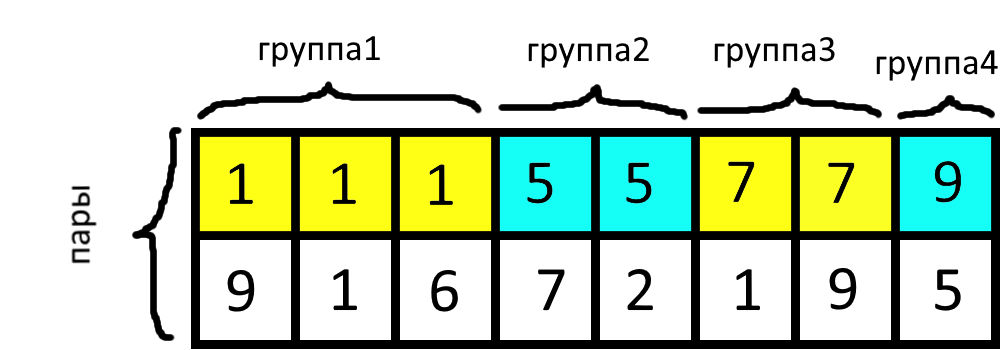
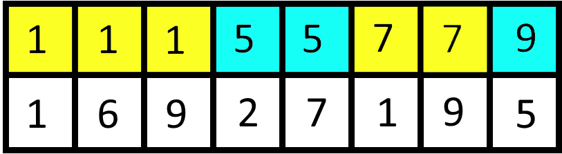

# Сортировки

Ответы: 2112

## Содержание

[**Что такое сортировка**](#Матчасть) 

[**Ассимптотика**](#Ассимптотика) 

[**Сортировка подсчётом**](#Сортировка-подсчётом)

[**Зачем сортируют**](#Сортируй-но-зачем) 

[**Сортировка pair и tuple**](#сортировка-pair-и-tuple) 

[**Сортировка строк**](#сортировка-строк) 

[**Сортировка собственных структур**](#сортировка-собственных-структур) 

[**Разбор**](#разбор-задач) 

## Матчасть

Что такое сортировка? *Такую проблему ставит автор текста.*

Сортировка - способ сделать из произвольного массива чисел отсортированный по возрастанию или по убыванию. Сортировки бывают разные по реализации, но результат работы у них один и тот же - отсортированный массив.

Например:  
Было: 1 4 5 3 2 1  
*Применили сортировку по возрастанию*  
Стало: 1 1 2 3 4 5

Вопрос: какие сортировки вы знаете?

## Ассимптотика

Разные реализации сортировок работают за разное время. Пусть n - длинна массива, который нужно отсортировать.  

Есть сортировка пузырьком: она работает за O(n^2)   
А есть сортировки merge sort, quick sort и др. : они работают за O(n\*log(n)), т.е. сильно быстрее. Например для  n = 1000, они работают в 100 раз быстрее.
Быстрее, чем за n\*log(n) невозможно в основном.  

Как уже было сказано в уроке STL, существует встроенная сортировка sort().
Она работает за O(n\*log(n)) - т.е. максимально быстро, насколько это возможно, поэтому чаще всего будем использовать её, а не писать свои сортировки.

Напомню, что sort работает так:
```c++
vector<int> v = {1,3,2,1};
sort(v.begin(),v.end()); // для сортировки по возрастанию
sort(v.rbegin(),v.rend()); // для сортировки по убыванию 
```

Возможно на паре по двум указателям будет рассказано, как писать merge sort, потому что там используются два указателя. Полезная сортировка.

## Сортировка подсчётом

Несмотря на наличие sort() мы всё-таки разберём одну сортировку. Сортировку подсчётом. Она полезна, поскольку похожий алгоритм используется для других программ.

Пусть нам дан массив чисел v = {1,3,2,2,1,4,1}

Тогда создадим второй вспомогательный массив cnt\[10000\]  
сnt\[i\] будет означать, сколько раз встречается число i в массиве v  
Чтобы этого достичь:
```c++
for(int i = 0; i < v.size(); i++){
	cnt[v[i]]++;
}
```

После этого куска кода массив cnt = {0,3,2,1,1,0,0,0,0....}

И чтобы отсортировать массив, теперь будем просто в порядке возрастания идти по массиву cnt и добавлять cnt\[i\] штук чисел i в новый массив ans:
```c++
vector<int> ans;
for(int i = 0; i < cnt.size(); i++){
	for(int j = 0; j < cnt[i]; j++){
		ans.pb(i);
	}
}
```  

Всё! Массив ans является отсортированной копией массива v!  
Данный алгоритм малоприменим, поскольку работает, только если в массиве v содержатся небольшие числа(поскольку иначе нам не хватит ни памяти, ни времени, чтобы создать массив cnt\[10000000000000\])  
Однако для небольших чисел работает за O(n + max_val), т.е. быстрее чем O(n\*logn)

### Подсчёт букв в слове

Чтобы посчитать количество каждой латинской буквы в строке s, обычно пишут следующее:
```c++
string s = "asxuhjlfjksdsdfgjshdfgkjhdslkg";
vector<int> cnt(26,0);  //26 - количество букв в англ. алфавите(надо знать)
for(auto t:s){  //перебираем по очереди все символы строки s
	cnt[t-'a']++;
}
```
Формально это разновидность сортировки подсчётом, но пригождается достаточно часто, в отличии от неё самой.  

Что такое `cnt[t-'a']` - спросит внимательный читатель?  В частности `t-'a'` означает вычитание символов друг из друга, т.е. расстояние между ними. Например:  
'a'-'a' = 0  
'b'-'a' = 1  
'c'-'a' = 2
...  
А например 'a'-'c' = -2, что логично.

Таким образом t-'a' означает номер буквы t в английском алфавите! И даже начиная с нуля, т.е. как нам и нужно, работая с массивами.

*P.S. под буквой t подразумевается какая-то буква англ. алфавита, не обяз. сама буква 't'*

После исполнения этого куска программы, в cnt\[i\] будет лежать количество раз, которое встречается буква(с номером i) в строке s. В частности cnt\[1\] - означает сколько раз встречается буква 'b' в строке s.

## Сортируй. Но зачем?

Сортируя, можно достигать разных целей. Приведу известные мне цели, достигаемые сортировкой.

1) Для жадных алгоритмов. Например вам очень нужно брать только максимальные элементы. Тогда вы сортируете массив по убыванию и берёте с начала.  

2) Чтобы по отсортированному массиву запускать бинпоиск или lower_bound и upper_bound.  

3) Для того, чтобы отсортировать события(по времени их происхождения) или точки(на координатной прямой ОХ), чтобы потом по отсортированному вектору их по очереди обрабатывать. 

## Сортировка pair и tuple

*Предупреждение: важно понять это, потому что в контесте достаточно много задач, на сортировку пар/таплов. Если непонятно - задавайте вопросы.*

Оказывается, сортировать можно не только числа, но и pair, и tuple! *(и даже собственные структуры)*

Как сортируются пары и таплы?

*В общем случае будем рассматривать pair, потому что pair - частный случай tuple с двумя элементами, а значит для тапла всё будет работать так же*

Задача: сравнить две пары(*Кстати, у таплов должно быть одинаковое количество полей, иначе их нельзя сравнивать!*). Т.е. узнать, какая пара больше, а какая меньше. Компилятор решает эту задачу так:  
1. Сравниваем первый элемент. Если у одной пары он больше, чем у другой, значит эта пара больше, чем другая. Если элементы равны - переходим к следующему шагу.  
2. Сравниваем второй элемент. Если у одной пары он больше, чем у другой, значит эта пара больше, чем другая. Если элементы равны - переходим к следующему шагу.  
3. Если у двух пар все элементы равны, то тогда пары равны.  

Например пара {1,2} меньше, чем пара {1,3}. А пара {2,9} меньше, чем пара {3,1}.  
Например тапл {5,2,1} больше, чем тапл {5,1,9}, потому что второй элемент у него больше.  
Заметим, что мы так же сравниваем и числа: 521 больше, чем 519, потому что второй разряд у него больше:)

Небольшое упражнение. Кто больше? *Ответы в начале статьи.*  
1. {8,9} или {9,1}
2. {1,2,3} или {1,1,9}  
3. {9,9,1} или {9,1,9}  
4. {1,2,-2} или {1,2,-1}  

Чтобы лучше понять, как отсортируется массив из пар, подумаем в таком ключе:  
1. Сначала пары отсортируются по первому элементу. Разобьются на группы с равными первыми элементами. Эти группы будут отсортированы *например* в порядке возрастания.  
Пикча:
<center></center>

2. Рассматриваем порядок в рамках каждой группы: Теперь в рамках каждой группы, пары отсортируются по второму элементу *например* в порядке возрастания. 
Пикча:
<center></center>


Чтобы задавать порядок в котором пары(или таплы) отсортируются на каждом шаге(по возрастанию или по убыванию) - можно применять небольшой трюк:
- Хотите, чтобы пары(таплы) на i-ом шаге отсортировались **по возрастанию**? - кладите i-ые элементы в сортируемые пары как они есть.
- Хотите, чтобы пары(таплы) на i-ом шаге отсортировались **по убыванию**? - кладите i-ые элементы в сортируемые пары со знаком минус.

*Доказательство этого трюка оставим на доказательство читателю.*

## Сортировка строк

Строки тоже можно сортировать! *(даже строки разных размеров)*

Они отсортируются в лексикографическом порядке, т.е. в таком порядке, как они были бы в словаре Даля или Ожегова:  
сначала сортируются по первой букве, потом по второй и т.д.

Аналогично таплам и парам, короче.

Из нюансов:
Строка "AAAA" будет стоять перед "AAAAa" в сортировке по возрастанию.

## Сортировка собственных структур

Альтренативой сортировки таплов и пар может служить сортировка структур. Она подойдёт вам, если вы любите писать красивый код(наверное это будет чуть дольше на олимпиаде).

В рамках этого курса нет возможности это сделать, поэтому [google](https://google.com) вам в помощь.

## Разбор задач

Произошёл или произойдёт на паре.
___

## [Sigma Omsk](https://vk.com/sigma_omsk) 2020
